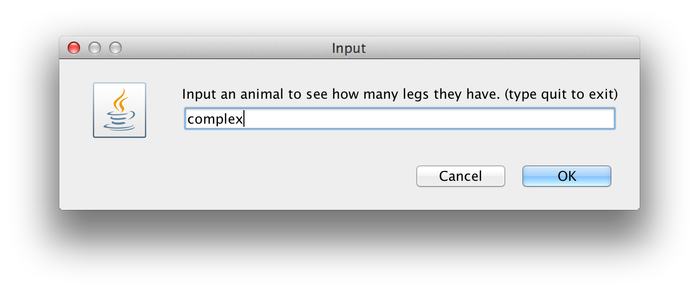

# annotation-example
This is a small example of how to make class level annotations. This also has some small examples of how to leverage some of Java 8's cool new features.

# Setup
Once you get this java program imported into your IDE (I used intellij to create this project) There is a `com.benjamingbaxter.annotation.example.HelloWorld` class you can run to make sure that the project is setup correctly.

# Running
Look for a `com.benjamingbaxter.annotation.example.ZooKeeper` class. Run this class in your IDE. You should see an input dialog for you to enter an animal key. You can enter "dog", "dodo", "whale", and "complex" as valid animals. Everything else will give you an error message.

If you cannot get the program running, hopefully the screen shots can help you follow along with the code.

# Screens
#### Starting Screen

#### Dog

#### Dodo

#### Whale

#### Complex
This animal has no default no-arg constructor so it will throw an exception at runtime

#### Kangaroo
There are no Kangaroo's in the example, so you will get an error message

#### Quit
Type quit to exit the program

